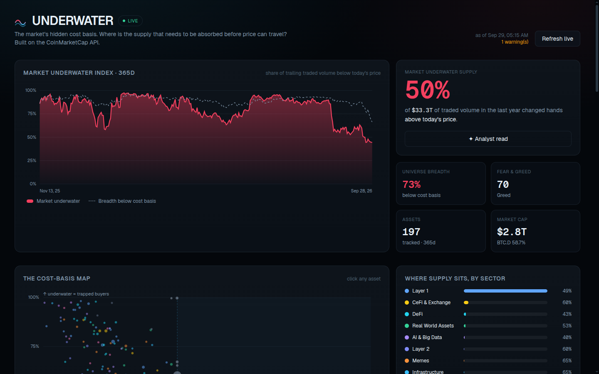

# UNDERWATER

**The market's hidden cost basis.** Where is the supply that must be absorbed before price can travel?

Built for the **Build with CMC: API Hackathon** — track: **Data & Visualisation**.

▶ **[Watch the 81-second demo](docs/demo.mp4)** · [script](docs/DEMO_SCRIPT.md) · [endpoints](docs/ENDPOINTS.md) · [API feedback](docs/API_FEEDBACK.md)



## The insight

Every market page shows you a price. None of them show you what the people holding the asset actually paid. UNDERWATER reconstructs an aggregate **cost basis** for the top ~200 assets from one year of daily price × volume, then measures the part that now sits at a loss — the **underwater supply**.

> At the time of writing: **50% of $33.3T** of traded volume in the last year changed hands above today's price, and **73%** of the tracked universe is trading below its cost basis. Privacy (84%) and Gaming (78%) are the most trapped sectors; AI & Big Data (40%) the least.

That is not visible anywhere in a normal price chart, and it is directly actionable: it quantifies the overhang of holders waiting to break even.

## What it does

- **Market Underwater Index** — a trailing cost-basis oscillator for the whole market, with a breadth line and a Fear & Greed overlay.
- **The cost-basis map** — every asset plotted by *price vs cost basis* (x) and *share of volume underwater* (y). Bottom-right is "clean air"; top-left is a wall of trapped holders.
- **Asset explorer** — search / filter / sort the universe by underwater supply.
- **Asset drawer** — a volume-by-price profile, a price-vs-running-cost-basis sparkline, and peer comparison for any asset.
- **Portfolio cost basis** — paste a portfolio as `SYMBOL value` and see its value-weighted underwater share and where the pain is concentrated.
- **Live refresh** — pull a fresh universe straight from the CoinMarketCap API.

## How the metric works

For each asset, over the trailing window (365 daily observations):

```
cost basis  = Σ(priceᵢ · volumeᵢ) / Σ(volumeᵢ)          # volume-weighted average price (VWAP)

underwater  = Σ volumeᵢ [priceᵢ > price_now] / Σ volumeᵢ  # share of traded volume above today's price

pain depth  = volume-weighted average loss of the underwater portion
```

A large `underwater` means most of the year's trading happened **above** the current price — i.e. the marginal holder is holding a loss, which is latent sell pressure.

**Why VWAP is a proxy.** CoinMarketCap exposes price and 24h volume but not realised entry price or holder cohorts, so VWAP is used as the standard proxy for the market's aggregate cost basis. This is stated in-app and is the subject of the API feedback below. Stablecoins are excluded (the peg makes the metric meaningless) and assets with fewer than 120 daily observations are dropped.

## Endpoints used

| Endpoint | Why |
|---|---|
| `GET /v1/cryptocurrency/listings/latest` | Universe, current quotes, tags → sectors, volumes |
| `GET /v1/cryptocurrency/quotes/historical` | 365 daily price + volume points per asset (the core input) |
| `GET /v3/fear-and-greed/historical` | Sentiment overlay on the market index |
| `GET /v1/global-metrics/quotes/latest` | Market-wide context (total cap, BTC dominance) |

Full details, parameters, credit costs and example calls: [`docs/ENDPOINTS.md`](docs/ENDPOINTS.md).

## Evidence of a real API call

Every figure ships with the raw response that produced it. Captured live against the hackathon key:

```
curl https://pro-api.coinmarketcap.com/v1/cryptocurrency/listings/latest?limit=2 \
  --header 'X-CMC_PRO_API_KEY: <key>'
```

Response (trimmed): [`evidence/listings.sample.json`](evidence/listings.sample.json) — `status.credit_count: 1`.

```
curl https://pro-api.coinmarketcap.com/v1/cryptocurrency/quotes/historical?id=1&interval=daily&count=3 \
  --header 'X-CMC_PRO_API_KEY: <key>'
```

Response: [`evidence/history.sample.json`](evidence/history.sample.json) — the daily rows the metric is built from.

The full dataset build is reproducible:

```bash
npm run build:dataset      # hits the API, writes data/underwater-snapshot.json
# last run: 197 assets · 715 credits · 26.9s
```

## What the API made possible / where it got in the way

**Made possible:** `quotes/historical` gives a clean, long, aligned daily series across the whole universe with a single batched call per 20 assets — enough to reconstruct a market-wide cost basis without any on-chain infrastructure. That is what makes this metric possible at all.

**In the way:** the plan caps history at **12 months** (a multi-cycle cost basis needs a higher tier); `quotes/historical` is billed per returned row, so a full 10k-asset universe is expensive (the top 200 costs ~715 credits); and there is **no field for realised entry price or holder cohorts**, so VWAP is a proxy. Full write-up: [`docs/API_FEEDBACK.md`](docs/API_FEEDBACK.md).

## Stack

Next.js 16 (App Router, React 19, TypeScript strict) · Tailwind v4 · hand-built SVG charts (no charting dependency) · a pure, testable metrics engine in `lib/underwater.ts`.

```
lib/cmc.ts         typed CMC client: auth, retries, sliding-window rate limiter, batching
lib/underwater.ts  the metrics engine (pure functions, no I/O)
lib/dataset.ts     bundled snapshot + live builder
scripts/           reproducible dataset build
components/        SVG charts, explorer, drawer, portfolio, panels
app/api/*          asset detail, live refresh, optional AI "analyst read"
```

## Run locally

```bash
npm install
echo "CMC_API_KEY=your_key" > .env.local
npm run build:dataset   # optional: regenerate the snapshot from live data
npm run dev             # http://localhost:3000
```

`npm run typecheck` and `npm run lint` are clean.

## Track

**Data & Visualisation.**

## Disclaimer

Not investment advice. Data © CoinMarketCap. The metric is an estimate built on a VWAP proxy.

`#BuildwithCMC`
