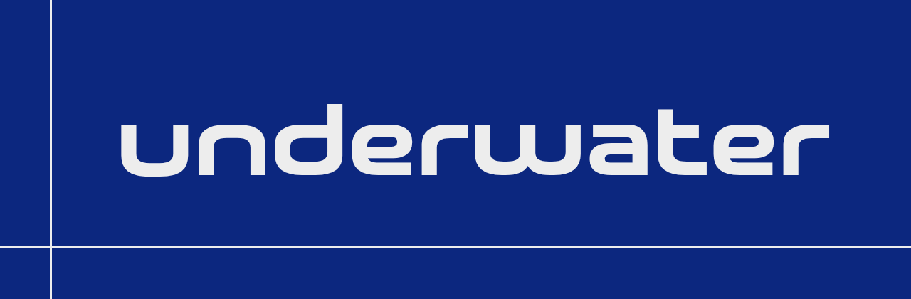
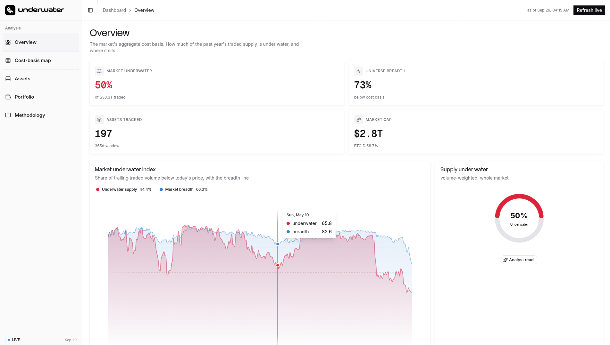
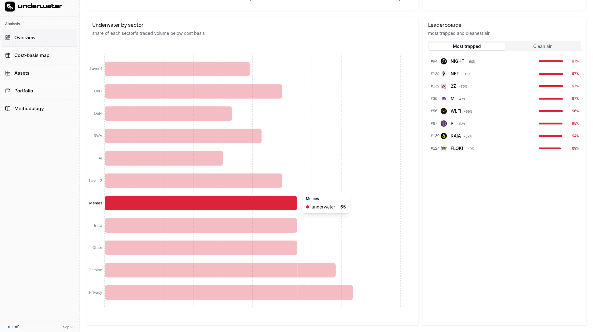
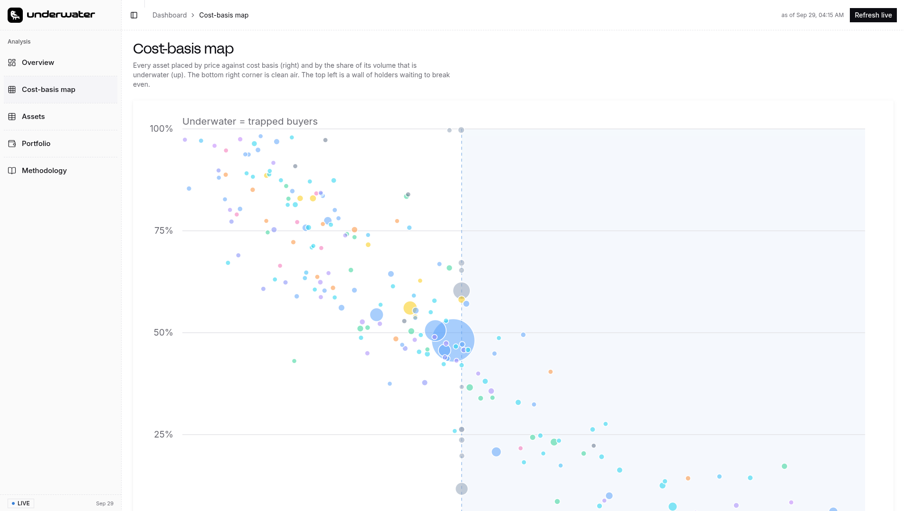
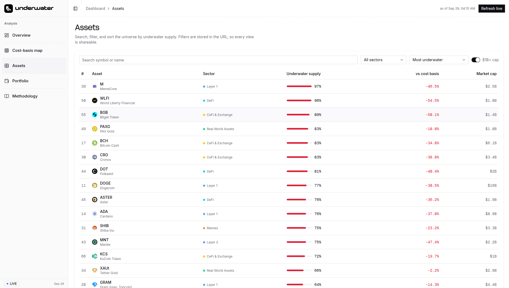
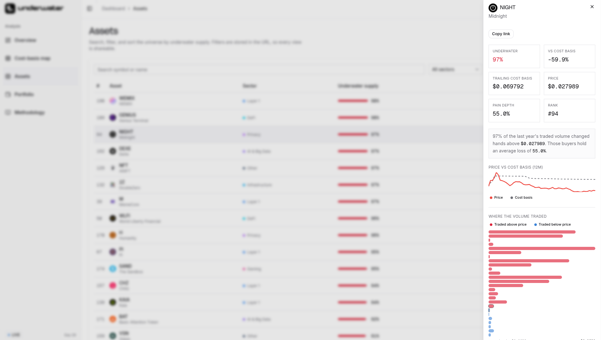

<p align="center">
  
</p>
<p align="center">
  <strong>The market's hidden cost basis.</strong>
</p>
<p align="center">
  Underwater rebuilds the aggregate cost basis of the top crypto assets from one year of CoinMarketCap daily price and volume data. Then it shows how much of the traded supply sits at a loss.
</p>
<p align="center">
  <a href="#how-it-works">How it works</a>
  ·
  <a href="#the-metric">The metric</a>
  ·
  <a href="#quickstart">Quickstart</a>
  ·
  <a href="#endpoints">Endpoints</a>
  ·
  <a href="#api-feedback">API feedback</a>
  ·
  <a href="docs/demo.mp4">Demo</a>
  ·
  <a href="docs/ENDPOINTS.md">Endpoint details</a>
</p>

---

# Underwater

Underwater is a market analysis tool. A price chart shows the current price. It does not show what the holders paid. Underwater estimates the average entry price of the market. Then it measures the part of that supply that is below the current price.

The tool covers the top 200 assets by market cap. It uses one year of daily data from the CoinMarketCap API. It computes the volume-weighted average price (VWAP) for each asset. It calls the share of volume above the current price the "underwater supply".

At the time of writing, 50 percent of 33.3 trillion US dollars of traded volume is underwater. 73 percent of the tracked universe is below its cost basis. Privacy (84 percent) and Gaming (78 percent) are the most trapped sectors. AI and Big Data (40 percent) is the least trapped.

Underwater shows this structure in one view. It is an estimate that uses VWAP as a proxy.

## Contents

- [How it works](#how-it-works)
- [The metric](#the-metric)
- [What it shows](#what-it-shows)
- [Live demo](#live-demo)
- [Quickstart](#quickstart)
- [Setup](#setup)
- [Endpoints](#endpoints)
- [Evidence of a real API call](#evidence-of-a-real-api-call)
- [API feedback](#api-feedback)
- [Stack](#stack)
- [Project layout](#project-layout)
- [Scope](#scope)
- [Development](#development)
- [Track](#track)
- [License](#license)

## How it works

1. **Fetch.** The server gets the top 200 assets from `listings/latest`. It reads the price, the volume, and the tags.
2. **Get history.** The server gets 365 daily points for each asset from `quotes/historical`. Each point has a price and a volume.
3. **Compute.** The engine computes the volume-weighted average price for each asset over the window.
4. **Measure.** The engine measures the share of volume that traded above the current price. That share is the underwater supply.
5. **Aggregate.** The engine builds a market index, a sector summary, and a portfolio view.
6. **Render.** The dashboard shows the results. A snapshot is bundled with the repository, so the demo always runs.

A full build costs about 715 credits and takes about 27 seconds.

## The metric

The engine computes three values for each asset over the 365-day window.

$$
\text{cost basis} = \frac{\sum \text{price}_i \cdot \text{volume}_i}{\sum \text{volume}_i}
$$

$$
\text{underwater} = \frac{\sum \text{volume}_i\, [\text{price}_i > \text{price}_{\text{now}}]}{\sum \text{volume}_i}
$$

$$
\text{pain depth} = \text{volume-weighted average loss of the underwater portion}
$$

The first formula is the volume-weighted average price (VWAP). The second is the share of traded volume above the current price. The third is the loss that the underwater part carries.

A high underwater value means most of the year's trading occurred above the current price. The average holder of that volume holds a loss. This is latent sell pressure.

**Why the tool uses VWAP.** The CoinMarketCap API returns price and 24-hour volume. It does not return the realised entry price or holder groups. VWAP is the standard proxy for the aggregate cost basis. The dashboard states this. The [API feedback](#api-feedback) section gives more detail.

Stablecoins are excluded, because the peg makes the metric meaningless. Assets with fewer than 120 daily points are dropped.

## What it shows

- **Market Underwater Index.** This chart shows the trailing cost basis of the whole market. It includes a breadth line and a Fear and Greed overlay.
- **Cost-basis map.** This plot places each asset by price against cost basis, and by underwater share. The bottom right corner is clean air. The top left corner is a wall of trapped holders.
- **Asset explorer.** You can search, filter, and sort the universe by underwater supply.
- **Asset drawer.** This panel shows a volume-by-price profile, a price against cost basis sparkline, and a peer comparison.
- **Portfolio cost basis.** Enter a portfolio as `SYMBOL value` on each line. The tool returns the value-weighted underwater share.
- **Live refresh.** This button pulls a fresh universe from the CoinMarketCap API.
- **Deep links.** Each asset has a URL, for example `?asset=DOGE`. The drawer has a copy link button.

The screenshots below use the bundled snapshot.

|  |
|---|
| <br>**Overview.** The market underwater index with the breadth line, and the supply under water. |
| <br>**Sectors and leaderboards.** Underwater share by sector, the most trapped assets, and the cleanest air. |
| <br>**Cost-basis map.** Every asset placed by price against cost basis, and by underwater share. |
| <br>**Asset explorer.** Search, filter, and sort the universe by underwater supply. |
| <br>**Asset drawer.** Price against cost basis, and the volume-by-price profile. |

## Live demo

- Live dashboard: https://underwater-cmc.vercel.app
- Demo video: [docs/demo.mp4](docs/demo.mp4) (81 seconds, narrated)
- Demo script: [docs/DEMO_SCRIPT.md](docs/DEMO_SCRIPT.md)

## Quickstart

```bash
git clone https://github.com/devroy10/underwater-cmc.git
cd underwater-cmc
bun install
echo "CMC_API_KEY=your_key" > .env.local
bun run dev
```

Open http://localhost:3000.

## Setup

| Variable | Required | Purpose |
|---|---|---|
| `CMC_API_KEY` | Yes | CoinMarketCap Pro API key. The server uses it for all live calls. |
| `GOOGLE_API_KEY` | No | Enables the "Analyst read" button. The button uses Gemini to write a short note about the current numbers. |

To regenerate the snapshot from live data:

```bash
bun run build:dataset
```

The last run used 197 assets, 715 credits, and 27 seconds.

Run the checks:

```bash
bun run typecheck
bun run lint
```

## Endpoints

| Method | Endpoint | Purpose |
|---|---|---|
| GET | `/v1/cryptocurrency/listings/latest` | Universe, current quotes, tags for sectors, volumes |
| GET | `/v1/cryptocurrency/quotes/historical` | 365 daily price and volume points for each asset |
| GET | `/v3/fear-and-greed/historical` | Sentiment overlay for the market index |
| GET | `/v1/global-metrics/quotes/latest` | Market-wide context, such as total cap and Bitcoin dominance |

Full parameters, credit costs, and example calls: [docs/ENDPOINTS.md](docs/ENDPOINTS.md).

## Evidence of a real API call

Each figure comes with the raw response that produced it. These calls ran against the hackathon key.

```bash
curl "https://pro-api.coinmarketcap.com/v1/cryptocurrency/listings/latest?limit=2" \
  --header "X-CMC_PRO_API_KEY: <key>"
```

Response: [evidence/listings.sample.json](evidence/listings.sample.json). The status object reports `credit_count: 1`.

```bash
curl "https://pro-api.coinmarketcap.com/v1/cryptocurrency/quotes/historical?id=1&interval=daily&count=3" \
  --header "X-CMC_PRO_API_KEY: <key>"
```

Response: [evidence/history.sample.json](evidence/history.sample.json). These are the daily rows that the metric uses.

The build is reproducible:

```bash
bun run build:dataset   # calls the API and writes data/underwater-snapshot.json
```

## API feedback

**What the API made possible.** `quotes/historical` returns one long, aligned daily series for many assets. One request can return 20 assets. This is enough to rebuild a market-wide cost basis without on-chain data.

**Where the API got in the way.**

- The plan limits history to 12 months. A full cycle needs a higher tier.
- `quotes/historical` bills for each returned row. A 10,000 asset universe is expensive. The top 200 costs about 715 credits.
- There is no field for realised entry price or holder groups. VWAP is a proxy, not ground truth.
- `listing_status=inactive` returns active coins. Survivorship analysis is not possible.
- Several endpoints in the hackathon brief return HTTP 403 on the provided plan, for example `market-pairs`, `ohlcv`, and `derivatives`.
- The MCP server lists tools, but `tools/call` returns `Token not found` with the same key.

Full write-up with reproduction steps: [docs/API_FEEDBACK.md](docs/API_FEEDBACK.md).

## Stack

Next.js 16 (App Router, React 19, TypeScript) with Tailwind v4. The charts are hand-built SVG. There is no charting library. The package manager is bun.

## Project layout

```
lib/cmc.ts         CMC client: auth, retries, rate limiter, batching
lib/underwater.ts  metrics engine (pure functions, no I/O)
lib/dataset.ts     bundled snapshot and live builder
scripts/           reproducible dataset build
components/        SVG charts, explorer, drawer, portfolio, panels
app/api/*          asset detail, live refresh, optional analyst read
```

## Scope

- The metric uses VWAP as a proxy for the cost basis. It is an estimate.
- The plan limits history to 12 months. The result depends on the window.
- Stablecoins are excluded. Assets with fewer than 120 daily points are dropped.
- The analyst read needs `GOOGLE_API_KEY`. Without it, the button returns a message.
- This tool is not investment advice. Data is copyright CoinMarketCap.

## Development

```bash
bun run dev             # development server on http://localhost:3000
bun run build           # production build
bun run build:dataset   # regenerate the snapshot from the live API
bun run typecheck       # TypeScript check
bun run lint            # ESLint
```

Deploy with Vercel. Vercel reads `bun.lock` and installs with bun. Set `CMC_API_KEY` and `GOOGLE_API_KEY` in the project environment.

## Track

Data and Visualisation.

## License

MIT. See [LICENSE](LICENSE).

`#BuildwithCMC`
